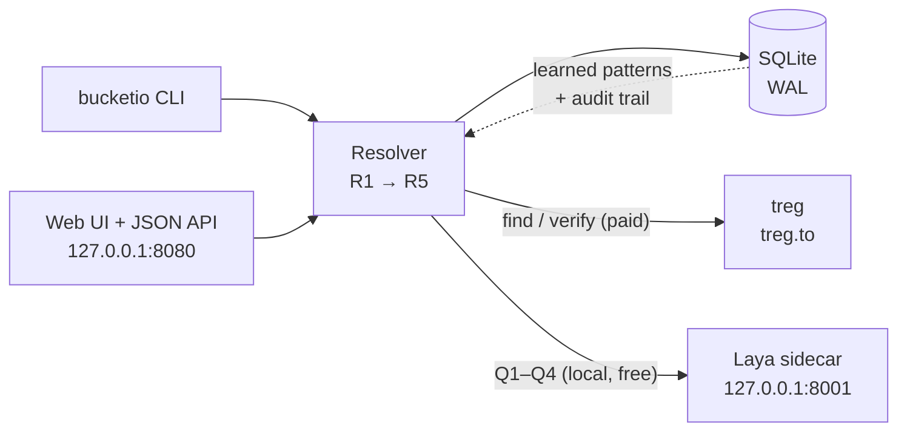
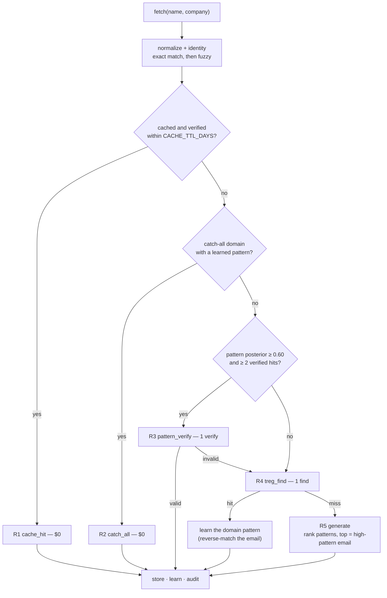
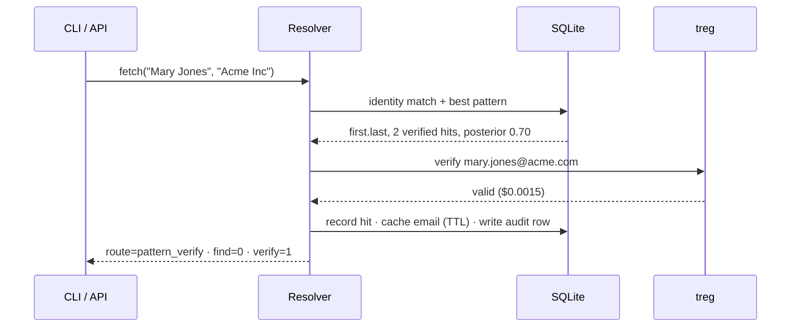

# BucketIO

<!-- Private repo: the live Actions badge 404s for anonymous image proxies, so it is a
     static badge that links to the runs. Swap in the real one once the repo is public:
     [](https://github.com/Mulla759/bucketio/actions/workflows/ci.yml) -->
[](https://github.com/Mulla759/bucketio/actions/workflows/ci.yml)
[](#development)
[](#requirements)

A local, self-hosted contact store (SQLite) that sits **in front of [Treg](https://treg.to)**.
It answers *"what is this person's work email?"* while spending as little as possible:

1. Known + recently verified contact → return it, **$0**.
2. Company email format known → build the address and ask Treg to **verify** (~$0.0015).
3. Otherwise ask Treg to **find** (~$0.0048–$0.15) — and learn the company's format
   from the answer, so the next person at that company is cheap.
4. Nothing found → return the highest-probability generated address with a confidence.

[Laya](https://huggingface.co/convaiinnovations/laya) runs as a **local sidecar** and acts as a
scorer / tie-breaker in the gray zones — never as a generator, and never trusted blindly: it
starts in `shadow` (asked and logged, zero influence) and is switched on per question type only
when `bucketio calibrate` shows it beats the rules.

| | |
|---|---|
| **Status** | v1 complete — 202 tests, live-verified end to end |
| **Build plan** | [`bucketio.md`](bucketio.md) |
| **Stack guide** | [`docs/LREG.md`](docs/LREG.md) |
| **Pass log** | [`PROGRESS.md`](PROGRESS.md) |

## Contents

- [Architecture](#architecture) · [The routing pipeline](#the-routing-pipeline) · [A cheap lookup, step by step](#a-cheap-lookup-step-by-step)
- [Requirements](#requirements) · [Quick start (offline)](#quick-start-offline-no-keys) · [Quick start (Lreg bundle)](#quick-start-the-lreg-bundle)
- [Configuration](#configuration) · [Laya: shadow first, active when measured](#laya-shadow-first-active-when-measured)
- [Treg calls and prices](#treg-calls-and-prices) · [Operations](#operations) · [Results](#results-live-end-to-end)
- [Security and privacy](#security-and-privacy) · [Development](#development) · [Layout](#layout) · [Troubleshooting](#troubleshooting) · [License](#license)

## Architecture



Both entry points call the same `resolver.fetch()`; the CLI opens the DB directly and does not
need the web server. Laya is reached over HTTP so the model stays warm across CLI invocations.

## The routing pipeline

Every fetch takes the **first** route that applies, and the route decides the cost:



| Route | When | Treg calls | Cost |
|---|---|---|---|
| `cache_hit` | known contact, verified within the TTL (90 d) | 0 | $0 |
| `catch_all` | domain is catch-all and a pattern is learned | 0 | $0 |
| `pattern_verify` | pattern known (posterior ≥ 0.60, ≥ 2 verified hits) | 1 verify | ~$0.0015 |
| `treg_find` | nothing known yet | 1 find | $0.0048–$0.15 |
| `generate` | find missed; rank by learned posterior | 0–1 verify | $0–$0.0015 |

Every outcome (valid **or** invalid) updates a per-domain Beta posterior, so a wrong guess is
avoided next time. Catch-all domains are marked once and never spend a verify again.

## A cheap lookup, step by step



The first two people at `acme.com` cost a find each (`treg_find`) — that is what *teaches*
`first.last`. Mary is the third, and she costs a verify instead of a find.

## Requirements

- Python **3.11–3.13** (Laya supports 3.10–3.13; `.python-version` pins 3.13)
- [`uv`](https://docs.astral.sh/uv/) for the environments
- Optional: a [treg](https://treg.to) token for real lookups (`TREG_MODE=http`)
- Optional: ~1.5 GB of model weights (English + multilingual checkpoints) plus the torch
  install, for the Laya sidecar (`LAYA_MODE=shadow|active`)

## Quick start (offline, no keys)

```powershell
uv sync --extra dev
uv run bucketio init
uv run bucketio fetch "Jane Doe" "Acme Inc" --json   # TREG_MODE=mock by default
uv run pytest -q                                     # 202 tests, no network
```

## Quick start (the Lreg bundle)

```powershell
.\scripts\setup_lreg.ps1     # macOS/Linux: ./scripts/setup_lreg.sh
```

Installs the app + `laya[serve]` (in a separate `.laya-venv`), creates `.env` with a **random
`LAYA_API_KEY`**, applies the schema, starts the Laya sidecar on `127.0.0.1:8001` and the web UI
on `http://127.0.0.1:8080`. Flags: `-SkipLaya` (BucketIO only), `-NoStart` (set up, start nothing).

```powershell
uv run bucketio lreg status      # what is up / what is configured
uv run bucketio report --since 7d
uv run bucketio calibrate
```

## Configuration

Copy `.env.example` to `.env` (the setup script does it). Safe defaults: `TREG_MODE=mock` and
`LAYA_MODE=off` run fully offline.

| Variable | Default | Meaning |
|---|---|---|
| `DB_PATH` | `./bucketio.db` | SQLite file (WAL) |
| `TREG_MODE` | `mock` | `mock` \| `http` \| `cli` |
| `TREG_BASE_URL` | `https://treg.to` | treg gateway |
| `TREG_TOKEN` | *(blank)* | falls back to `~/.treg/config.json` when blank |
| `TREG_ORG` | *(blank)* | only for identity tokens |
| `TREG_FIND_COST` / `TREG_VERIFY_COST` | `0.004834` / `0.0015` | used for the cost report |
| `LAYA_MODE` | `off` | `off` \| `shadow` \| `active` |
| `LAYA_TRANSPORT` | `http` | `http` \| `inprocess` |
| `LAYA_URL` | `http://127.0.0.1:8001` | sidecar address |
| `LAYA_API_KEY` | *(generated)* | shared secret for the sidecar |
| `LAYA_TIMEOUT_S` | `4.0` | measured CPU latency is 0.7–2.0 s |
| `LAYA_WEIGHT` | `0.3` | blend weight when `rank` is active |
| `CACHE_TTL_DAYS` | `90` | `cache_hit` freshness |
| `VERIFY_MIN_POSTERIOR` / `VERIFY_MIN_HITS` | `0.60` / `2` | `pattern_verify` gate |
| `VERIFY_MAX_TRIES` | `2` | verifies per lookup before falling back to find |
| `GENERATE_VERIFY_TOP` | `1` | verify the top generated candidate |

## Laya: shadow first, active when measured

Laya is a **classifier** — it never writes an email. BucketIO generates candidates from the
learned patterns and asks Laya up to four choice questions per fetch:

| Question | Asked when | Active effect (gated) |
|---|---|---|
| Q1 identity | fuzzy match lands in 80–95 | merge into the existing contact at ≥ 0.80 |
| Q2 route | best pattern posterior in [0.45, 0.60) or only 1 verified hit | force/skip the pattern verify at ≥ 0.75 |
| Q3 rank | every `generate` and `pattern_verify` | blend `0.7·rules + 0.3·Laya` and re-rank |
| Q4 plausible | every `treg_find` hit | logged only (conflict audit) |

Modes: `off` → `shadow` (asked and logged, **zero** influence — a golden test asserts
byte-identical outputs to `off`) → `active`. Activation is per question type and data-driven:
`bucketio calibrate` fits one temperature per (question, option count) and enables a type only
when `accuracy > rules_accuracy` with `n_samples ≥ 50`. Flip back to `shadow` at any time.

Measured on CPU with `LAYA_PRELOAD=1`: ~0.7–1.0 s for a `route` question and ~1.3–2.0 s for a
`rank` question with 12 candidates — hence `LAYA_TIMEOUT_S=4.0`. A timeout or error is recorded
and never blocks a fetch.

## Treg calls and prices

Live, checked 2026-09-24 (routed endpoints; you pay the child that serves, 0% markup):

| Job | Endpoint | Price |
|---|---|---|
| Find a work email | `treg.people.email.find` (22 providers) | from **$0.004834**/hit |
| Verify an email | `treg.people.email.verify` (11 providers) | **$0** (ContactOut) → $0.0138 |

That gap is the whole point: a typical verify (~$0.0015) is ~3× cheaper than the cheapest
find and up to ~100× cheaper than the priciest. `TREG_MODE=http` uses the token from
`TREG_TOKEN` or, if blank, from `~/.treg/config.json` (written by `treg login`).

## Operations

```powershell
uv run bucketio lreg status        # stack health (DB, Laya, treg, web)
uv run bucketio report --since 7d  # routes, calls, $ saved, Laya agreement
uv run bucketio calibrate          # fit temperatures + show the activation gate
uv run bucketio unmerge 412        # undo a soft merge
.\scripts\backup.ps1               # online SQLite backup -> backups/
```

`do_not_contact = 1` contacts are never exported (CSV or `/api/export`). Concurrent identical
fetches are serialised per identity, so a duplicate in flight costs nothing extra.

## Results (live end-to-end)

| Input | Route | Result |
|---|---|---|
| Jane Doe / Acme Inc | `treg_find` | jane.doe@acme.com (valid) |
| John Smith / Acme | `treg_find` | john.smith@acme.com (valid) |
| Mary Jones / Acme Inc | `pattern_verify` | mary.jones@acme.com — 1 verify, 0 finds |
| Casper Ghost / Ghost Co | `generate` | casper.ghost@ghost.co (pattern_guess) |
| Peter Gibbons / Initech | `treg_find` | catch-all domain learned from the hit |
| Milton Waddams / Initech | `catch_all` | 0 Treg calls |

Report: `find=4 verify=2 cost=$0.0175 est_saved=$0.0115`; Laya answered all 6 questions
(`routed_model: english`, `applied: 0`) with truth backfilled; calibration fitted 1 row and
correctly enabled nothing (< 50 samples).

## Security and privacy

- **Secrets never live in the repo.** `.env` is git-ignored; the DB stores no credentials.
  The treg token is read from `TREG_TOKEN` or the treg CLI's own config file.
- **The Laya sidecar is local-only.** Setup binds `127.0.0.1`, requires `LAYA_API_KEY`, and
  generates a random key instead of the placeholder. Change it for anything shared.
- **No shell interpolation.** The treg CLI adapter uses `subprocess.run([...])` with an argument
  list, a timeout and no `shell=True`; the web UI renders through React, which escapes every
  string (no `dangerouslySetInnerHTML` anywhere).
- **Compliance is yours.** BucketIO stores business contact data only; you are responsible for
  CAN-SPAM/GDPR use of the output. `do_not_contact` rows are excluded from every export.

## Development

```powershell
uv sync --extra dev
uv run pytest -q          # 202 tests, no network, no keys
uv run bucketio --help
```

CI ([`.github/workflows/ci.yml`](.github/workflows/ci.yml)) runs the suite on Python 3.11 and
3.13 plus an offline CLI smoke test (`init` → `fetch` against the mock). It is intentionally
light: tests only, no deploy, no secrets, so it cannot block work for environmental reasons.

### Web UI

`bucketio/web` is the built site — it is committed, so `bucketio serve` works from a fresh
clone. Its source is the Vite + React app in `frontend/`:

```powershell
cd frontend
npm install
npm run dev          # http://127.0.0.1:5173, API proxied to 127.0.0.1:8080
npm run typecheck    # tsc --noEmit
npm run build        # writes ../bucketio/web (index.html + assets/)
```

## Layout

```
bucketio/               # the installable package
  schema.sql            # SQLite schema (packaged; migrate() is idempotent)
  config.py             # pydantic-settings, safe offline defaults
  db.py                 # connect / migrate / tx
  normalize.py          # names, nicknames, ASCII folding, company keys
  identity.py           # exact + fuzzy identity, company aliases
  patterns.py           # 12 email patterns, reverse-match, Beta posteriors
  treg.py               # Treg adapter: mock / http / cli
  resolver.py           # the pipeline: R1 cache → R2 catch_all → R3 verify → R4 find → R5 generate
  laya_client.py        # Laya sidecar client + Q1–Q4 question builders
  calibrate.py          # temperature fit + activation gate
  report.py             # finds avoided, $ saved, Laya lift
  csv_io.py             # sheet import/export (do_not_contact respected)
  api.py  cli.py        # FastAPI + typer
  web/                  # the built site (index.html + assets/) that `serve` mounts
frontend/               # Vite + React source for web/ (npm run build)
  src/                  # App, one component per section, lib/, styles/
  assets/               # self-hosted fonts, agent marks, avatar
scripts/                # setup_lreg.*, run_laya.*, backup.*
tests/                  # 202 tests; fixtures/treg_mock.json
design/                 # the original phone-book design handoff (prototype, fonts)
.github/workflows/ci.yml
docs/LREG.md            # the Laya + treg + BucketIO stack guide
```

## Deploying to Vercel

Import the repository into Vercel as-is — no dashboard settings needed. Vercel auto-detects the
FastAPI app from the `fastapi` dependency, so `pyproject.toml` points it at the real module:

```toml
[tool.vercel]
entrypoint = "bucketio.api:app"
```

The FastAPI preset then deploys the whole app as a single Vercel Function and promotes the
`bucketio/web` `StaticFiles` mount (registered after every `/api` route, so the API wins) to the
CDN. `vercel.json` only sets the build command, which rebuilds the directory from `frontend/` into
`bucketio/web` before deploy:

```json
{ "buildCommand": "cd frontend && npm ci --no-audit --no-fund && npm run build" }
```

- `DB_PATH=/tmp/bucketio.db` is the default automatically on Vercel (`VERCEL` is set and `/tmp` is
  the only writable path); the schema migration runs in the app's FastAPI lifespan.
- Treg runs in `mock` mode unless `TREG_TOKEN`/`TREG_MODE` are configured, so the deployed API
  works offline out of the box, and the site falls back to the in-browser demo if `/health` is
  unreachable.
- Persistent SQLite is **not** guaranteed on Vercel: `/tmp` is per-instance and ephemeral, so
  data may reset between cold starts. Point `DB_PATH` at durable storage if you need persistence.

## Troubleshooting

| Symptom | Cause / fix |
|---|---|
| First Laya call times out | The first request loads a checkpoint; longer states cost more (~1.3–2.0 s on CPU). `LAYA_TIMEOUT_S=4.0` covers it; retry once if a cold start still exceeds it. |
| `laya-serve` hangs at startup | TensorFlow in the same env. `USE_TF=0` is set by the scripts. |
| `/health` shows `laya.reachable: false` | Sidecar down, wrong port, or `LAYA_API_KEY` mismatch. Check `.lreg/logs/laya.err.log`. |
| treg 402 | Out of balance — `treg balance`, top up, or connect your own key. |
| treg 503 `provider_capacity_unavailable` | treg's provider account is out; retry in a minute. Nothing was charged. |
| Laya answers look overconfident | Run `bucketio calibrate`; `active` only uses calibrated, gated question types. |

## License

MIT — see [`LICENSE`](LICENSE).
